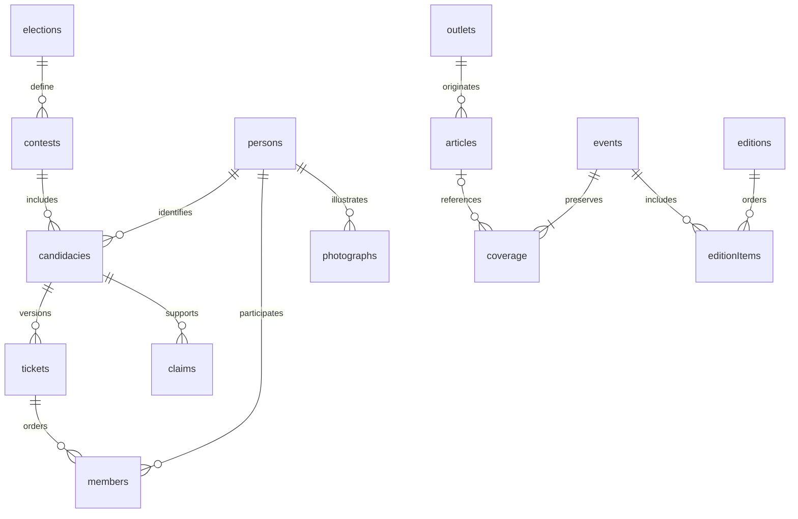

# B01 — contrato civic v1

Implementação de #210 sobre main `f99ac18` (PR #205 integrada), com o planejamento da PR #228 incorporado por merge de sua branch. A autorização posterior de Stefan para implementar substitui o escopo exclusivamente documental inicial. Esta entrega fornece contratos executáveis, fixtures e migração; não instala rotas, jobs ou dados em produção.

## Arquitetura e fontes de verdade

`shared/civic-contract.js` é o schema normativo dos 17 tipos: todos os campos são obrigatórios, nulos são explícitos, campos desconhecidos são rejeitados. `validateCivicDataset` verifica o conjunto e suas relações. `shared/civic-fixtures.js` exporta `civicFixture()` para Back, Front e App. `back/src/civic-schema.js` gera a migração a partir dos mesmos descritores, sem tocar no schema `public` do jogo. A API continua em `back/` e as futuras telas no único pacote `app/`.



Cada entidade referencia sua origem conforme o schema; `sources` registra URL HTTPS, publicador, localizador, licença, geração e instantes de origem/coleta. `changes` e `versions` guardam auditoria e snapshots imutáveis das seis entidades publicáveis. São registros internos; não devem ser enviados integralmente ao leitor, pois incluem identidade do editor.

Pessoa não é candidatura. O ID de candidatura codifica eleição, circunscrição, cargo e chave da fonte, escapando cada segmento. Homônimos não se fundem. `contests.vacancies` vem da configuração oficial, nunca de constante por cargo. Presidente usa BR; governador e senador usam uma das 27 UFs. Vínculo com o catálogo do jogo é opcional e carrega revisão própria; não importa aprovação do catálogo anterior.

Composição usa intervalos `[validFrom, validTo)` sem sobreposição para a mesma candidatura. Executivo completo exige titular na posição 0 e vice na 1; Senado completo exige titular 0 e suplentes 1 e 2. `partial` permite lacuna explícita, sem inventar integrantes. Nova composição exige novo ID de chapa; histórico não é sobrescrito pelo importador. O banco verifica composição e sobreposição nas alterações de chapas/integrantes. Alterações futuras em pessoa/cargo da candidatura devem passar novamente pelo validador completo na transação de importação.

## Leitura e exemplos executáveis

Os helpers são contratos puros, não endpoints HTTP já disponíveis. B06 montará transporte e autorização. Exemplo consumível diretamente pelos testes e mocks:

```js
import { civicFixture } from '../../../shared/civic-fixtures.js';
import { directoryPage } from '../../../shared/civic-contract.js';
const fixture = civicFixture();
const response = directoryPage(
  { contestId: 'president', limit: 1, sort: 'name' },
  fixture.records.candidacies,
  { revision: 1, officialTotal: 2 },
);
// { version: 1, revision: 1, items: [candidacy], nextCursor: string,
//   filteredCount: 2,
//   coverage: { official: 2, imported: 2, published: 2, unpublished: 0 } }
```

Filtros aceitos: `contestId` obrigatório, `party`, `officialStatus`, `search` por nome ou número, `limit` de 1 a 100 (padrão 30), `cursor` e `sort: name`. Campos de identidade, voto, localização e preferências do jogo são rejeitados. Ordenação normaliza acentos/caixa e desempata por ID. O cursor é opaco ao cliente, não é credencial; vincula filtros e revisão do diretório. Filtros de texto têm limite de 512 caracteres e cursor de 16.384. A revisão deve mudar em toda alteração de conteúdo público, incluindo retirada; o servidor B06 será responsável por esse incremento.

Somente registros `published/approved` aparecem. A cobertura é do recorte inteiro, antes dos filtros: `official` é denominador oficial reconciliado, `imported` inclui rascunhos, `published` conta publicados e `unpublished = official - published` inclui ausentes e não publicados. Foto/proposta/notícia não altera esses totais. Ausência de denominador oficial não deve ser convertida em zero: a camada importadora/API deve sinalizar indisponibilidade até reconciliar. Comparação aceita 2–3 IDs distintos publicados do mesmo `contestId`.

Erros lançam `CivicContractError` com `code` e mensagem técnica. B06 deverá mapear `CIVIC_INVALID` para HTTP 400 e `CIVIC_STALE_CURSOR` para 409, sem devolver payload privado. Exemplo de envelope futuro: `{ "error": { "code": "CIVIC_STALE_CURSOR", "message": "Reinicie a paginação." } }`. Falha de provedor não é diretório vazio; B06/B07 definirão indisponibilidade operacional (503) e limites (429).

Instantes usam UTC ISO com milissegundos; edição usa data civil real e `America/Sao_Paulo`. `sourceAt`, `fetchedAt`, `statusAt`, `updatedAt` e `changes.at` têm papéis distintos. A idade de uma coleta não comprova revisão editorial recente.

## Notícias, estados e retirada

Cada acontecimento conserva exatamente três espaços `right`, `left`, `international`. `present` exige matéria publicada, classificação aprovada/versionada e justificativa de relevância. Os demais estados são `not_found`, `collection_failed`, `restricted`, `pending`, `contested`, `withdrawn`, com motivo e instante de verificação obrigatórios. Lacuna não vira matéria sintética.

Internacional se refere ao país da redação de origem (`originOutletId`), inclusive em republicações; não significa neutralidade. Orientação é separada do gênero (`opinion`, `reporting` etc.), país, acesso e permissão de uso. `newsroom` permite detectar dependência editorial. Relações de tradução/republicação não podem formar ciclos. B04/B05 ainda deverão verificar independência, relevância temporal e agrupamento do mesmo fato: schema não comprova essas decisões.

Revisão: `pending`, `approved`, `contested`, `rejected`. Publicação: `draft`, `published`, `withdrawn`. Aprovação no JSON é estado, não prova de autorização. Só B06 poderá implementar transições autenticadas, com permissão editorial, nova revisão, snapshot e evento de auditoria na mesma transação. Fotografias publicadas exigem `rights: permitted`; o importador deve verificar licença, não apenas preencher o campo.

Retirada preserva versão anterior e novo snapshot `withdrawn`, com evento `withdraw`. Contrato para B06/App: uma leitura individual retirada retorna 410 com ID/revisão, e invalida a entrada local; listas passam a omiti-la e mudam de revisão. Respostas editoriais deverão revalidar com servidor antes da exibição; o service worker não poderá servir cópia antiga após retirada conhecida. Não há implementação de cache ou endpoint de retirada nesta unidade.

## Migração e rollback

Aplicação explícita, usando o mesmo PostgreSQL/driver `pg` já adotado pelo backend:

```sh
node back/scripts/civic-migrate.mjs up
node back/scripts/civic-migrate.mjs down-empty
```

`DATABASE_URL` é obrigatório. Não executar em produção como consequência de iniciar o servidor. Migração é transacional, serializada por advisory lock e idempotente por versão/checksum. FKs diferíveis, unicidades, índices, estados e triggers de composição protegem a base. Escritas da aplicação precisam também executar os validadores de contrato; nem toda regra semântica é uma constraint SQL.

`down-empty` bloqueia tabelas, recusa qualquer dado importado e usa `RESTRICT`, sem remoção em cascata de dependências externas. Após carga, rollback é desativar consumidores/jobs e manter dados/histórico, não apagar o schema. A inserção B01 aceita somente fixtures sintéticas e não é exposta por HTTP.

CI `back-shared.yml` executa `civic-schema-smoke.mjs` em PostgreSQL 16 descartável, depois dos ensaios existentes do jogo: migração, repetição, rollback vazio, nova migração, carga, recusa de rollback populado, integridade de chapas, história imutável e fingerprint inalterado de todas as tabelas/linhas preexistentes em `public`.

## Matriz de cenários e revisão dos consumidores

| Cenário | Evidência |
| --- | --- |
| Presidente e homônimos | Duas candidaturas, IDs distintos, paginação estável |
| Governador com troca de vice | Duas vigências adjacentes; sobreposição rejeitada |
| Senado histórico/atual | Dois suplentes em ordem; vagas são dados |
| Pessoa fora do jogo | Todos os vínculos sintéticos são nulos |
| Foto/proposta ausente | Denominador eleitoral preservado |
| Publicação sem revisão/licença | Rejeição do contrato/constraint aplicável |
| Notícias parciais | Matéria de opinião e lacunas explícitas |
| Republicação/tradução/paywall | Origem separada e acesso restrito representado |
| Correção/retirada | Snapshots e auditoria; retirada excluída da leitura |
| Privacidade | Campos desconhecidos e sinais privados rejeitados |

Fixtures são inventadas, datadas de 2032/2028, com domínios `example.test` e licença declarada somente para o conteúdo sintético. Nenhum recorte oficial ou artigo real foi copiado. Isso não comprova cobertura nacional, dados aprovados ou piloto real.

Front e App podem usar os exports acima para protótipos. Revisão conjunta da terminologia, formato final e estratégia de migração permanece pendente; esta documentação não registra aceite humano nem encerra #210.
